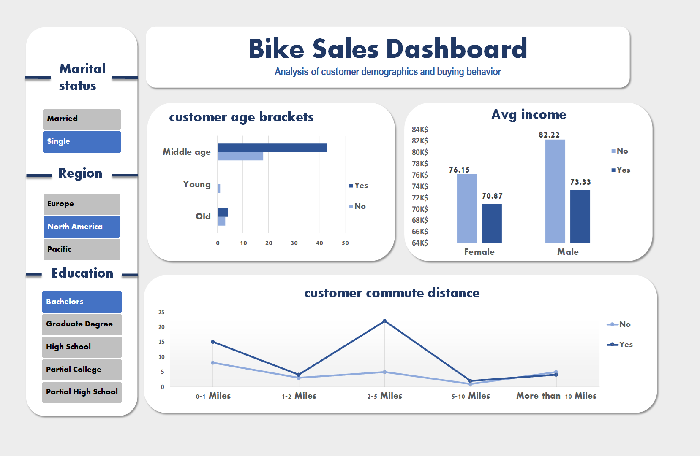

# Bike Sales Dashboard (Excel)

**Excel dashboard analyzing bike purchases by customer demographics and commute distance.**

## Description
This project contains an interactive Excel dashboard that visualizes bike purchase behavior by demographic attributes (age, gender, education, region, commute distance) and income. The dashboard uses slicers for interactivity and pivot tables for calculations.

**Tools used:** Excel (Tables, PivotTables, Slicers, Charts)

## Files
- `Bike Sales Dashboard.xlsx` — Excel workbook with raw data (sheet: `RawData`) and dashboard (sheet: `Dashboard`).  
- `Dashboard.png` — Screenshot of the dashboard.  

## How to open & use
1. Download `Bike Sales Dashboard.xlsx`.  
2. Open in Excel and click **Enable Editing** if prompted.  
3. Go to the `Dashboard` sheet.  
4. To refresh pivot tables/slicers after editing data: **Preparing Data → Refresh All**.  
5. Use slicers on the left to filter by Region / Education / Marital status.

## Key insights 

## License
This repo is for portfolio/demo purposes. ( MIT / CC-BY-NC.)

## Contact
Fatima Zahra — (optional) add email or LinkedIn link
